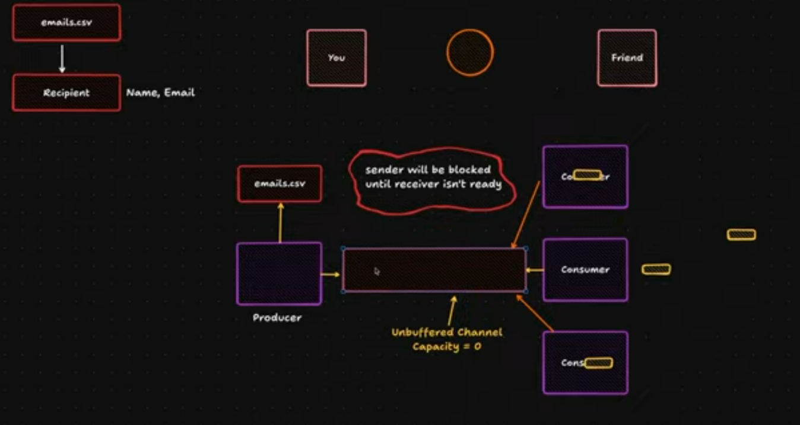

# small-mailing-service
Golang and mailchimp

1. Use resources efficient
2. Send emails concurrently

| Package        | Purpose               | Think of it as    |
| **`os`**       | Working with the *operating system*: files, directories, env vars | “How I open or create files”           |
| **`io`**       | Defines **interfaces** like `Reader`, `Writer`, `Closer`          | “The common language” for data streams |
| **`bufio`**    | Adds buffering and helpers for `io.Reader`/`Writer`               | “Makes reading/writing more efficient” |
| **`encoding/csv`**, `json`, etc. | Specific data format encoders/decoders          | “How I interpret the stream”           |
| **`bytes`**, `strings`           | In-memory data sources that *act like* streams  | “Fake files in memory”                 |

----------------------------------------

mailpit - email and SMTP testing tool with API for developers

docker run -d \
--restart unless-stopped \
--name=mailpit \
-p 8025:8025 \
-p 1025:1025 \
axllent/mailpit